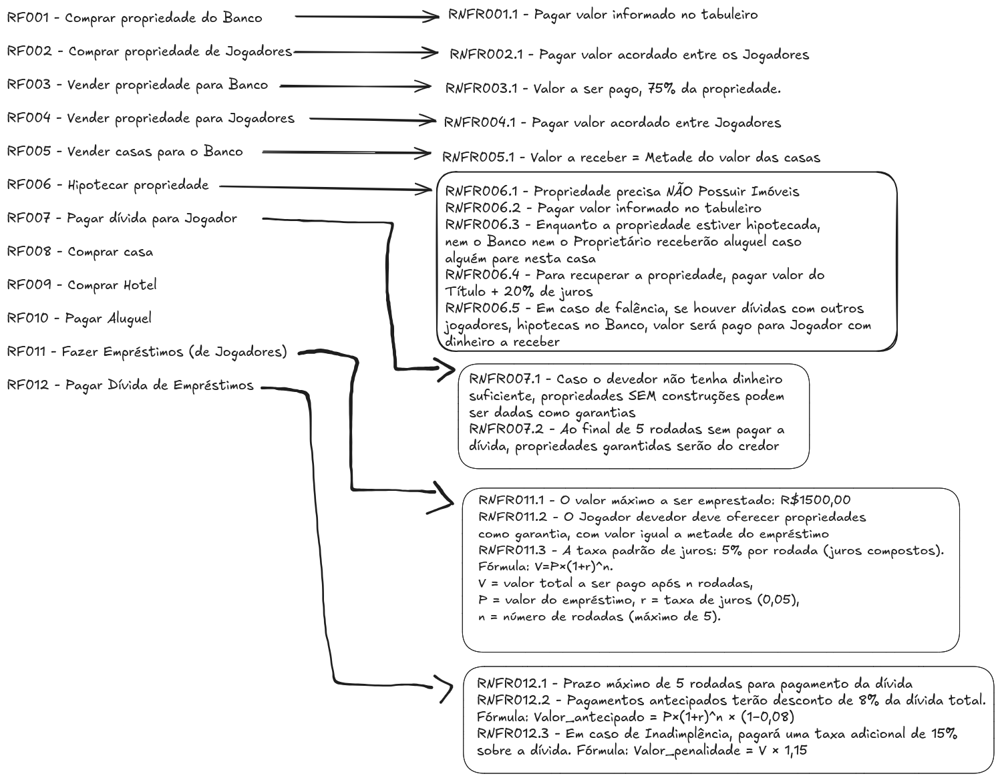
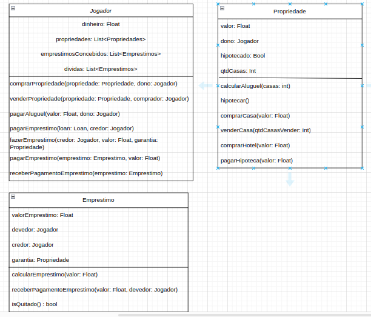

<a id="readme-top"></a>

<br />
<div align="center">

<h1 align="center">Banco Imobiliário Plus</h1>

  <p align="center">
    <strong>Banco Imobiliário aprimorado com a opção de empréstimos entre jogadores.</strong>
    <br />
  </p>
</div>


<!-- ABOUT THE PROJECT -->
## Sobre o Projeto

**Projeto de Recriação do Banco Imobiliário com Empréstimos entre Jogadores**

Este projeto tem como objetivo recriar o clássico jogo Banco Imobiliário, mantendo todas as regras originais, mas com um diferencial: a introdução da possibilidade de Empréstimos entre Jogadores.

O acréscimo desse mecanismo visa aumentar a dinâmica do jogo, permitindo maior interatividade e estratégia entre os participantes. Diferentemente da versão tradicional, onde os jogadores precisam 
depender exclusivamente de suas próprias finanças e negociações diretas de compra e venda, agora é possível obter recursos financeiros diretamente de outros jogadores.

Ressalta-se que este projeto é desenvolvido exclusivamente para fins de estudo, explorando conceitos de programação orientada a objetos e modelagem de regras de negócios em um ambiente interativo. 
Não há qualquer intenção comercial ou de distribuição do jogo.

Com essa abordagem, o projeto busca proporcionar uma experiência inovadora dentro de um clássico consagrado, incentivando o pensamento estratégico e a interação entre os jogadores de forma mais envolvente.


<p align="right">(<a href="#readme-top">back to top</a>)</p>


<!-- Coomo foi feito -->
## Planejamento

**Estruturação do Projeto: Banco Imobiliário com Empréstimos entre Jogadores**

Para garantir um desenvolvimento organizado e eficiente deste projeto, foi essencial a utilização de diversas ferramentas e técnicas de estruturação antes mesmo da implementação do código.

O primeiro passo foi a classificação e análise dos Requisitos Funcionais e Não-Funcionais do sistema. Essa etapa foi crucial para identificar as funcionalidades essenciais que o jogo deveria conter, 
como regras básicas do Banco Imobiliário e a nova mecânica de empréstimos entre jogadores. Os requisitos não-funcionais, por sua vez, garantiram aspectos como as regras das funcionalidades a serem implementadas.
<br />


<br />

Além disso, realizei a elaboração de um diagrama de classes, permitindo visualizar a relação entre os elementos do sistema e definir de forma clara suas interações. Isso possibilitou uma modelagem eficiente e estruturada dos componentes do jogo.
<br />



Esse planejamento inicial proporcionou uma base sólida para a implementação do jogo. E, por mais que posteriormente modificações desse planejamento ocorreram,
ainda assim ter esses esquemas já prontos, reduziram retrabalhos e garantiram uma execução mais fluida e eficiente do desenvolvimento.

<p align="right">(<a href="#readme-top">back to top</a>)</p>


<!-- USAGE EXAMPLES -->
## Como Jogar

Este jogo foi desenvolvido com a intenção de ser simples e direto, pois foi idealizado como uma atividade de estudo. Por essa razão, não há implementação de interface gráfica, e toda a interação ocorre diretamente pelo terminal.

A simplicidade na execução também reflete a proposta do projeto. Para jogar, basta clonar o repositório do GitHub e executar a classe Main.java. Dessa forma, qualquer pessoa interessada pode testar e estudar o funcionamento do jogo sem a necessidade de configurações complexas.

1. Clone the repo
   ```
   git clone https://github.com/kevinveidembaum/BancoImobiliarioPlus.git
   ```

2. Execute a Classe Main.java
   

<p align="right">(<a href="#readme-top">back to top</a>)</p>


<!-- CONTACT -->
## Contact

Kevin Nikolai - [LinkedIn](https://www.linkedin.com/in/kevin-nikolai/) - kveidembaum@gmail.com

Project Link: [https://github.com/kevinveidembaum/BancoImobiliarioPlus](https://github.com/kevinveidembaum/BancoImobiliarioPlus)

<p align="right">(<a href="#readme-top">back to top</a>)</p>


